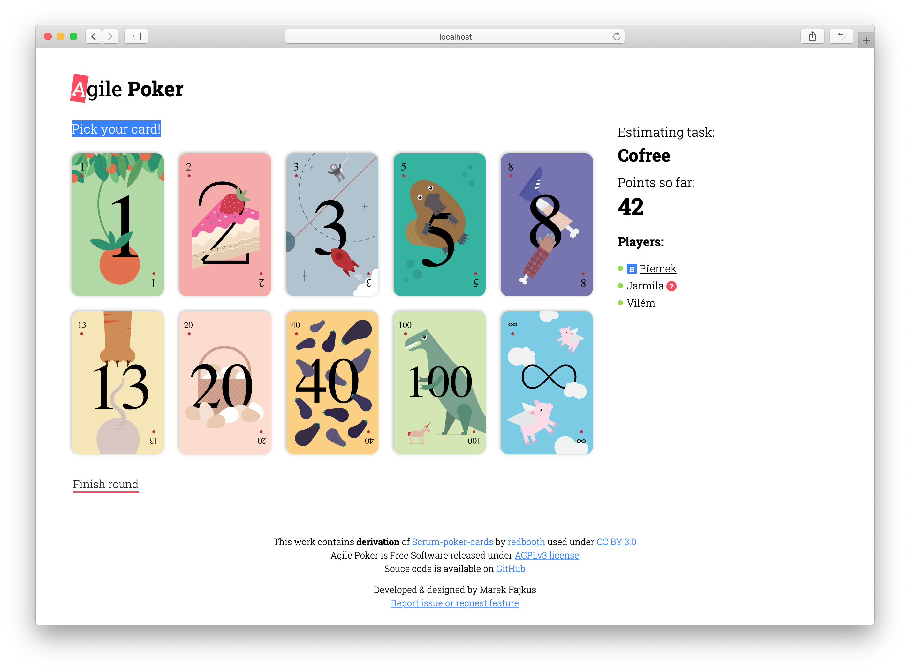

<div align="center">
    <h1>Planning Game</h1>
    <p>Planning tool for remote teams.</p>
    <!-- Badges -->
    <a href="https://travis-ci.org/turboMaCk/planning-game">
        
    </a>
    <a href="https://www.gnu.org/licenses/agpl-3.0.en.html">
        
    <a>
    <p><a href="https://planning-game.com">planning-game.com</a></p>
</div>



Simple voting poker implementation build with efficiency,
flexibility and easy deployment in mind.
Enabling remote teams to effectively identify complexity
and unclear requirements in collaborative way.

## Quick Start

Use free hosted service at [planning-game.com](https://planning-game.com)

Run locally:

```shell
$ docker run -p 3000:3000 --rm -it turbomack/planning-game
```

## Links

- [Cookies Usage](docs/COOKIES.md)
- [Contributing Guidelines](CONTRIBUTING.md)
- [Self Hosting](docs/HOSTING.md)

## License

This work contains **derivation** of [Scrum-poker-cards](https://github.com/redbooth/Scrum-poker-cards)
by [redbooth](https://redbooth.com/) used under [CC BY 3.0](https://creativecommons.org/licenses/by/3.0/).

Planning Game is Free Software released under [AGPLv3](https://www.gnu.org/licenses/agpl-3.0.en.html).
